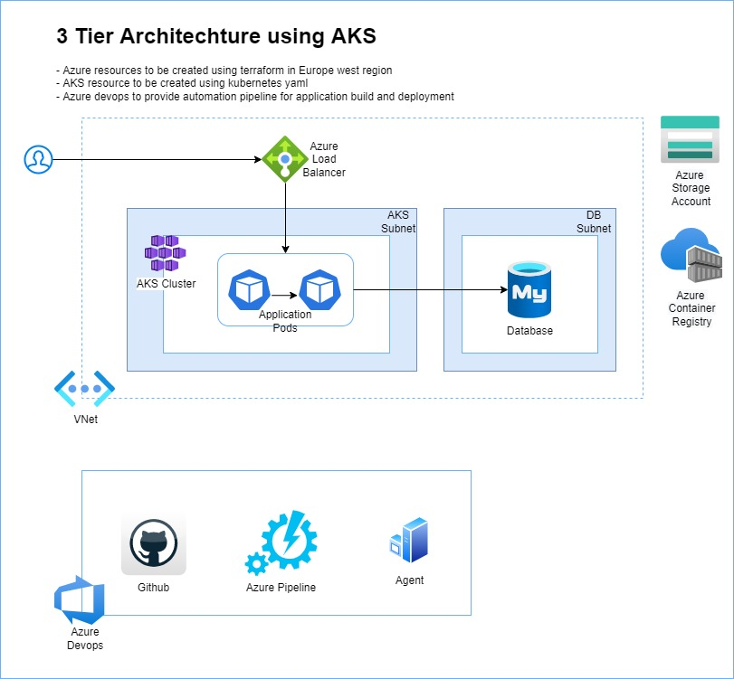

# Spring Demo App with MySql DB on Azure Services
This is a spring demo application with mysql database a backend

# Getting Started
1. Build the spring application

```sh
   mvnw clean compile package
```
2. Build the docker image

```sh
   docker build -t latest
```
3. Scan the docker using grype

```sh
   grype demoapp:latest -o table
```
# Environment Setup

 * Azure resources are setup from terrafrom-azure-resources
 * Once the AKS and mysql db are create run the below query to setup the database
```sql
    create database db_example; -- Creates the new database
    create user 'springuser'@'%' identified by 'xxx'; -- Creates the user
    grant all on db_example.* to 'springuser'@'%'; -- Gives all privileges to the new user on the newly created database
```
 * Create secretes for kubenetes
```sh
    kubectl create namespace demoapp
    kubectl create secret docker-registry acrcred --docker-server=xx --docker-username=xxxx --docker-password=xxxx -n demoapp
```

 * Run the kubectl to create kubernetes resource

 ```sh
   kubectl apply -f demo-app.yml
```

# Azure Architechture
